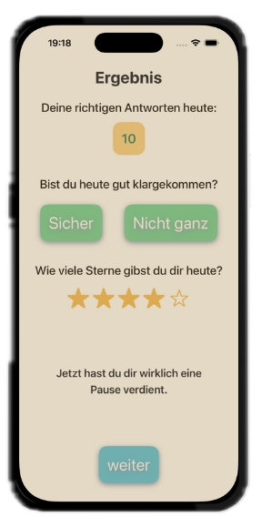
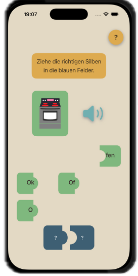
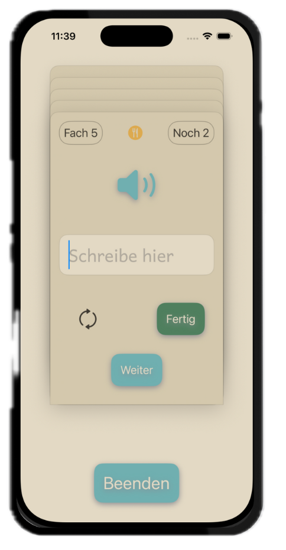
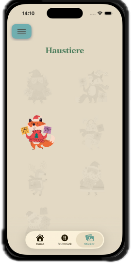

# LoRaS Welt

  
**LoRaS Welt – Rechtschreibung lernen ohne Druck**

**LoRaS Welt** ist eine Lern-App für Kinder mit Lese-Rechtschreib-Schwäche (LRS). Sie wurde mit dem Ziel entwickelt, Rechtschreibung nicht defizitär zu bewerten, sondern verständlich, strukturiert und motivierend zu vermitteln.

Kinder mit LRS erwerben Schriftsprache nicht beiläufig. Während neurotypische Kinder Rechtschreibmuster häufig implizit durch Lesen und Schreiben internalisieren, benötigen Kinder mit LRS eine  **explizite, klare und wiederholte Vermittlung**  von Regeln sowie unterstützende Strategien für Wörter, die keinen festen Regeln folgen.

Die App trägt dieser besonderen Lernvoraussetzung Rechnung, indem sie eine  **bewertungsfreie Lernumgebung**  schafft. Sowohl UX als auch visuelles Design sind bewusst darauf ausgelegt, Motivation zu fördern und Selbstwirksamkeit zu stärken, statt Defizite in den Fokus zu rücken.

Zentrales Element der App ist das Maskottchen  **Lora**, ein Papagei, der die Kinder als Lernbegleiterin unterstützt. Die Wahl dieser Figur folgt einer bewussten inneren Logik: Papageien können hervorragend zuhören und sprechen, verfügen jedoch – genau wie viele Kinder mit LRS – nicht über einen intuitiven Zugang zur Schriftsprache.

Lora teilt somit die zentrale Herausforderung der Zielgruppe. Sie erklärt Regeln, gibt Hinweise und positives Feedback, ohne als lehrende Instanz aufzutreten. Stattdessen begleitet sie die Kinder als Identifikationsfigur und „Mitlernende“ auf ihrem Weg. Lernen wird so nicht als Korrektur eines Defizits erlebt, sondern als gemeinsamer Prozess.

Diese Rollenwahl unterstützt das Ziel der App, Selbstvertrauen zu stärken und eine Lernumgebung zu schaffen, in der Fehler nicht bewertet, sondern als Teil des Lernens verstanden werden.

## Didaktischer Hintergrund und Lösungsansätze

Die App kombiniert zwei zentrale Lernansätze:

### 1. Regelbasiertes Lernen
Rechtschreibung folgt in vielen Bereichen klaren Regeln, die für Kinder mit LRS gezielt und strukturiert aufbereitet werden müssen. Die App unterstützt das  **Verstehen, Erinnern und Anwenden**  solcher Regeln, z. B.:

> _Auf kurze Vokale folgen doppelte Konsonanten._

### 2. Memorierendes Lernen (regelunabhängige Wörter)

Ein Teil der deutschen Rechtschreibung basiert auf häufig verwendeten Wörtern, die keiner eindeutigen Regel folgen (z. B. Funktionswörter). Aufbauend auf Empfehlungen für den schulischen Rechtschreibunterricht werden diese Wörter in der App über ein  **Karteikartensystem**  trainiert.

Besonders schwierige Wörter können individuell markiert und gezielt wiederholt werden. Ziel ist es, Sicherheit im Umgang mit häufigen Wörtern zu schaffen, die Fehlerquote zu senken und Frustration nachhaltig zu reduzieren.

****

## Design

**Füge hier am Ende die Screenshots deiner App ein.**

Das Design der App ist konsequent auf  **Reduktion, Klarheit und emotionale Sicherheit**  ausgerichtet. Ziel ist es, eine Lernumgebung zu schaffen, die Konzentration unterstützt und Kinder mit LRS nicht durch visuelle oder funktionale Überladung zusätzlich belastet.

Die Benutzeroberfläche arbeitet mit großzügigem Weißraum, klaren Layoutstrukturen und einer begrenzten Anzahl gleichzeitiger Interaktionselemente. Dadurch wird der Fokus stets auf eine einzelne Aufgabe gelenkt.

### Farb- und Formkonzept

Farben werden funktional, nicht bewertend eingesetzt. Es existieren keine farbcodierten Rückmeldungen für richtig oder falsch. Stattdessen dienen Farben der Orientierung und Wiedererkennbarkeit einzelner UI-Elemente (z. B. Hinweise, Aktionen, Fortschrittsdarstellungen).

Individuelle UI-Elemente wie die Puzzleteil-Shapes wurden gezielt eingesetzt, um Lerninhalte visuell zu strukturieren und spielerisch zugänglich zu machen. Die Formen wurden in  **Figma**  entworfen und anschließend in SwiftUI umgesetzt.

### Typografie

Eine speziell eingebundene Schriftart, die der  **Grundschrift**  entspricht, unterstützt den schulischen Kontext der App. Dadurch werden Buchstabenformen vermieden, die Kindern im Unterricht nicht begegnen (z. B. zweistöckige Varianten), um zusätzliche kognitive Hürden zu reduzieren.

### Feedback und Selbstreflexion

Feedback wird bewusst zurückhaltend gestaltet. Statt unmittelbarer Leistungsbewertung erhalten Kinder nach Abschluss einer Lerneinheit die Möglichkeit zur  **Selbsteinschätzung**. Im Self-Evaluation-Screen können sie angeben, wie sicher sie sich gefühlt haben und wie sie ihre eigene Leistung einschätzen.

Diese Form der Reflexion stärkt Selbstwahrnehmung und Selbstwirksamkeit und rückt das subjektive Lernerleben stärker in den Fokus als externe Bewertung.

****

### Gestaltung und visuelle Assets

Die Bilddateien des Maskottchens  **Lora**  wurden mithilfe von  **ChatGPT**  erstellt und dienten im Projektkontext als visuelle Platzhalter zur Unterstützung von UX- und Designkonzepten.

Im Falle einer Veröffentlichung der App würden diese Illustrationen einem professionellen Designer als  **Template und gestalterische Referenz**  zur Verfügung gestellt und entsprechend überarbeitet oder neu umgesetzt.

## Features

### Bewertungsfreies Fehlerkonzept

Die App verzichtet bewusst auf negative Rückmeldungen bei falschen Eingaben. Fehler werden nicht markiert, kommentiert oder hervorgehoben.

-   In Auswahl- und Grid-Übungen bleibt eine falsche Auswahl ohne Reaktion.
    
-   Beim Puzzle wird ein falsch platziertes Teil ruhig an seinen Ausgangsplatz zurückgelegt.
    
-   In der Karteikarten-Übung wechseln korrekt beantwortete Wörter in das nächste Fach, während falsch beantwortete Wörter unverändert verbleiben.
    

Dieses Vorgehen vermeidet eine Defizitorientierung und reduziert Frustration sowie Ablenkung, die insbesondere bei Kindern mit LRS lernhemmend wirken können.

### Mehrstufige Übungsabläufe mit Fokus auf Verstehen

Regeln werden nicht isoliert abgefragt, sondern über mehrere aufeinander aufbauende Übungsformate vermittelt (Erkennen, Analysieren, Anwenden, Produzieren).  
Dabei werden auditive, visuelle und motorische Zugänge kombiniert, ohne einzelne Schritte explizit zu bewerten.

****      ****

### Punkte- und Levelsystem ohne Leistungsdruck

Die App verfügt über ein Punktesystem sowie ein mehrstufiges Levelsystem. Dieses ist jedoch  **nicht leistungs- oder zeitbasiert**, sondern als Zustandsveränderung konzipiert.

Die Levelbezeichnungen vermeiden bewusst eine defizitorientierte Progressionslogik und beschreiben stattdessen unterschiedliche Lernzustände:

-   Regel-Entdeckende
    
-   Regel-Forschende
    
-   Regel-Wissende
    
-   Regel-Anwendende
    
-   Regel-Profis
    
-   Rechtschreib-Stars
    

Das Levelsystem vermittelt Entwicklung, ohne den Eindruck von „noch nicht gut genug sein“ zu erzeugen.

### Reduzierte Ablenkung während der Lernphasen

Punkte werden  **nicht während der Übungen sichtbar erhöht**, sondern erst nach dem aktiven Beenden einer Lerneinheit gesammelt und in einer separaten Fortschrittsanzeige (Gauge) dargestellt.

Dadurch bleiben die Lernphasen frei von leistungsbezogener Ablenkung, und der Fokus liegt vollständig auf dem Übungsinhalt.

Ein Levelaufstieg wird anschließend in einem separaten Pokal-Screen visualisiert, der bewusst außerhalb der eigentlichen Lerninteraktion liegt.

### Klare Trennung von Kinder- und Elternbereich

Die App unterscheidet konsequent zwischen einem  **Lernbereich für Kinder**  und einem  **Funktionsbereich für Eltern**.

-   Der Kinderbereich ist über die Tabbar erreichbar und enthält ausschließlich lern- und motivationsbezogene Inhalte (Übungen, Frühstücks-Vokabeln, Sticker).
    
-   Der Elternbereich ist über ein separates Menü zugänglich und umfasst organisatorische Funktionen wie Ausloggen, perspektivisch Datenverwaltung und Fortschrittsübersicht.

Diese Trennung verhindert, dass organisatorische oder evaluative Elemente den Lernprozess der Kinder stören.

### Motivation durch Durchhalten statt Leistungsbewertung

Ergänzend zu Punkten und Leveln verfügt die App über ein  **dezentes Stickersystem**, das bewusst  **nicht leistungsbasiert**arbeitet. Sticker werden nicht für eine bestimmte Anzahl richtiger Antworten oder fehlerfreie Durchgänge vergeben, sondern bereits dafür, dass sich ein Kind erneut mit einer Übung auseinandersetzt.

Konkret genügt bereits  **eine einzige korrekt bearbeitete Aufgabe**  (z. B. das erfolgreiche Lernen eines einzelnen Wortes), um einen Sticker zu erhalten. Die Vergabe ist damit an  **Motivation, Dranbleiben und Lernbereitschaft**  gekoppelt – nicht an Umfang oder Perfektion der Leistung.

Die Sticker werden bewusst  **zurückhaltend präsentiert**. Sie erscheinen nicht während der Übung selbst, sondern lediglich als dezenter Hinweis (Badge) innerhalb der Tabbar, dass eine neue Belohnung verfügbar ist. Dadurch wird der Lernprozess nicht unterbrochen oder überlagert.

Dieses System unterstützt das Ziel der App,  **intrinsische Motivation zu stärken**, ohne Leistungsdruck oder Vergleich zu erzeugen. Lernen wird als etwas Positives und Wiederholbares erlebt – unabhängig davon, wie schnell oder fehlerfrei Fortschritte erzielt werden.

**[]**

## Technischer Aufbau

### Architektur und Projektstruktur

Die App ist nach dem  **Model–View–ViewModel (MVVM)**-Architekturmuster aufgebaut, um eine klare Trennung von Darstellung, Logik und Datenhaltung zu gewährleisten. Zentrale fachliche Domänen der App sind jeweils durch eigene  **ViewModels**  abgebildet, sodass Zustandsverwaltung und Geschäftslogik klar von den SwiftUI-Views entkoppelt sind.

### Ordnerstruktur (Auswahl)

-   **Models / ViewModels**  
    Die vier zentralen fachlichen Modelle der App verfügen jeweils über ein eigenes ViewModel. Diese übernehmen die Zustandsverwaltung, die Interaktion mit externen Datenquellen sowie die Vorbereitung der Daten für die Views.
    
-   **Repositories**  
    Die Kommunikation mit externen APIs ist in einem dedizierten  **API-Repository**  gekapselt. Darüber werden Bildressourcen zu den geübten Wörtern geladen. Diese Abstraktion erleichtert Testbarkeit und spätere Erweiterungen.
    
-   **Audio**  
    Da die App einen starken Fokus auf auditive Übungen hat, existiert ein eigener Ordner für  **Audiodateien**, die zentral verwaltet und in den Übungen verwendet werden.
    
-   **Enums**  
    Enums werden gezielt eingesetzt, um Zustände, Übungstypen und Konfigurationsoptionen klar zu definieren. Dies erhöht die Reproduzierbarkeit, verbessert die Lesbarkeit des Codes und erleichtert eine spätere Erweiterung um zusätzliche Fälle.
    
-   **Helper**  
    Ein Helper übernimmt die  **JSON-Kodierung und -Dekodierung**  eines Structs, das im  `UserViewModel`  verwendet wird. Dadurch können Nutzerdaten strukturiert in  **Firebase**  gespeichert und wieder ausgelesen werden.
    
-   **Extensions & Styles**  
    Wiederverwendbare  **TextExtensions**  sowie eigene  **ButtonStyles**  sorgen für konsistente Gestaltung und vermeiden Redundanzen im UI-Code.
    
-   **Fonts**  
    Die App verwendet eine zusätzlich eingebundene Schriftart, die der  **Grundschrift**  entspricht. Dies vermeidet beispielsweise zweistöckige „a“-Formen, die im schulischen Kontext nicht benutzt, unterstützt die didaktische Zielsetzung der App und vermeidet unnötige Verwirrung.

### Datenhaltung und Persistenz

Die App nutzt  **Firebase**  zur Speicherung nutzerbezogener Daten. Der Fokus liegt dabei auf der geräteübergreifenden Verfügbarkeit, der Synchronisation des Lernfortschritts sowie einer einfachen Verwaltung des Nutzerzustands.

#### Gespeicherte Daten

In Firebase werden folgende Daten persistiert:

-   **Nutzerdaten**
    
    -   E-Mail-Adresse des Accounts
        
    -   Name des Kindes (zur personalisierten Ansprache innerhalb der App)
        
    -   Kennzeichnung, ob es sich um einen  **Erst-Login**  handelt  
        → Diese Information wird verwendet, um beim ersten Start eine geführte Einführung durch die App anzubieten.
        
-   **Lern- und Übungsfortschritt**
    
    -   Fortschritt innerhalb einer Übung, die nach dem Prinzip von  **Karteikarten**  arbeitet  
        Diese Übung fokussiert Wörter, die im schulischen Kontext häufig vorausgesetzt werden, ohne explizit regelbasiert vermittelt zu werden, und daher insbesondere bei Kindern mit LRS zu erhöhten Fehlerquoten führen können.
        
    -   Markierung von  **besonders schwierigen Wörtern**, die vom Kind individuell gekennzeichnet werden.
        
-   **Individuelle Wortauswahl**
    
    -   Wörter, die als besonders schwierig markiert wurden, werden in einer separaten Abfrage („**Vokabeln zum Frühstück**“) erneut geübt.  
        Dieses Konzept basiert auf der Annahme, dass das Gehirn unmittelbar nach dem Aufstehen besonders aufnahmefähig ist. Die Auswahl dieser Wörter wird ebenfalls nutzerbezogen in Firebase gespeichert.

#### Begründung der Technologieentscheidung

Firebase wurde gewählt, da es:

-   eine  **persistente, geräteübergreifende Speicherung**  des Lernfortschritts ermöglicht,
    
-   eine  **konsistente Synchronisation**  der Nutzerdaten bei erneutem Login sicherstellt,
    
-   sich gut in SwiftUI-basierte Apps integrieren lässt
    
-   und für den hier benötigten Umfang an strukturierten Nutzerdaten eine schlanke und zuverlässige Lösung darstellt.
    

Ein weiterer zentraler Aspekt ist die  **potenzielle Nutzung der App auf unterschiedlichen Endgeräten**. Kinder sollen ihren Account nicht nur auf einem privaten Gerät, sondern perspektivisch auch auf  **schulischen iPads**  oder anderen gemeinsam genutzten Geräten verwenden können. Eine zentrale Datenhaltung verhindert dabei divergierende Lernstände und reduziert Frustration durch inkonsistente Fortschritte.

Eine lokale Datenhaltung (z. B. über SwiftData) wurde bewusst nicht eingesetzt, da der Fokus weniger auf einem Offline-First-Ansatz als vielmehr auf der  **dauerhaften Verfügbarkeit, Synchronität und Konsistenz**  der nutzerbezogenen Lern- und Fortschrittsdaten liegt.  

### Nutzung externer APIs

Für die Bereitstellung von Bildmaterial zu den geübten Wörtern wird die  **Pixabay API**  verwendet. Die Bilder dienen der visuellen Unterstützung der auditiven Übungen und werden dynamisch zu den jeweiligen Begriffen geladen.

#### Begründung der API-Auswahl

Die Entscheidung für die Pixabay API fiel insbesondere aufgrund der integrierten  **SafeSearch-Funktion**, die ausschließlich Inhalte ausliefert, die für  **alle Altersgruppen**  geeignet sind. Da sich die App explizit an Kinder richtet, ist es essenziell, sicherzustellen, dass keine ungeeigneten oder potenziell verstörenden Inhalte angezeigt werden.

Darüber hinaus erfüllt die Nutzung einer externen API die formalen Anforderungen des Abschlussprojekts und ermöglicht eine realistische Abbildung eines produktionsnahen App-Szenarios, in dem externe Datenquellen integriert werden.

#### Einordnung und Ausblick

Trotz der implementierten Sicherheitsmechanismen bleibt die Nutzung einer externen Bild-API mit einem gewissen Restrisiko verbunden, da die Kontrolle über die ausgelieferten Inhalte nicht vollständig in der Anwendung selbst liegt. Für eine potenzielle Veröffentlichung der App wäre daher eine alternative Lösung denkbar, bei der das Bildmaterial  **kuratiert und lokal hinterlegt**  wird. Dies würde eine vollständige inhaltliche Kontrolle ermöglichen und den pädagogischen Anspruch der App weiter stärken.

  
### 3rd-Party Frameworks

Die App verwendet bewusst nur eine sehr geringe Anzahl externer Abhängigkeiten.

-   **Firebase**  
    Wird über das offizielle SDK eingebunden und dient der Authentifizierung sowie der persistente Speicherung und Synchronisation nutzerbezogener Daten über mehrere Geräte hinweg.
    

Darüber hinaus werden keine weiteren 3rd-Party Frameworks eingesetzt. Die Benutzeroberfläche, Anwendungslogik sowie Netzwerkkommunikation sind vollständig mit Bordmitteln des iOS-SDKs umgesetzt.

Im Verlauf der Entwicklung wurde der Einsatz eines externen Frameworks zur Darstellung von  **Markdown-Inhalten in SwiftUI-Views**  evaluiert, um erklärende Texte modular auslagern zu können. Aufgrund von Integrationsproblemen und mangelnder Stabilität wurde auf dessen Verwendung verzichtet. Die Entscheidung erfolgte bewusst zugunsten einer robusten, wartbaren Lösung ohne zusätzliche Abhängigkeiten.

  

## Ausblick

Für eine Weiterentwicklung der App bieten sich mehrere fachliche und funktionale Erweiterungen an, die inhaltlich an die bestehende Architektur und das didaktische Konzept anschließen.

### Erweiterung der Lerninhalte

Aktuell wird eine zentrale Rechtschreibregel exemplarisch und umfassend umgesetzt. Perspektivisch könnten weitere für Kinder mit LRS relevante Bereiche ergänzt werden, unter anderem:

-   Arbeit mit  **Minimalpaaren**
    
-   **Lautunterscheidung**  und phonologische Bewusstheit
    
-   **Silbentrennung**
    
-   **Groß- und Kleinschreibung**
    
-   **Umlaute**
    
-   **Dehnungslaute**
    
-   Erweiterung der Konsonantenverdopplung um  **Konsonantencluster**  wie  _ck_  und  _tz_
    

Dabei soll das bestehende mehrstufige, bewertungsfreie Übungskonzept beibehalten und auf weitere Regeln übertragen werden.

### Vertiefte Einführung und Begleitung

Die vorhandene Einführung in die App könnte weiter ausgebaut werden, um die einzelnen Lernbereiche, Übungstypen und Level transparenter zu erklären. Eine detailliertere Einführung würde insbesondere neuen Nutzer:innen helfen, die Struktur der App besser zu verstehen und eigenständig passende Lernwege zu wählen.

### Ausbau des Elternbereichs

Der Elternbereich ist konzeptionell angelegt, jedoch bislang funktional nur grundlegend umgesetzt. Perspektivisch könnten hier zusätzliche Funktionen integriert werden, z. B.:

-   Einsicht in Lernfortschritte
    
-   Verwaltung von Nutzerdaten
    
-   Anpassung von Einstellungen und Lernschwerpunkten
    

Diese Erweiterungen würden die klare Trennung zwischen Lern- und Organisationsbereich weiter stärken, ohne den Lernprozess der Kinder zu beeinträchtigen.

Die App versteht sich hier nicht als fertiges Produkt, sondern als fundierter Prototyp, der zeigt, wie Lernen ohne Leistungsdruck gestaltet werden kann.
